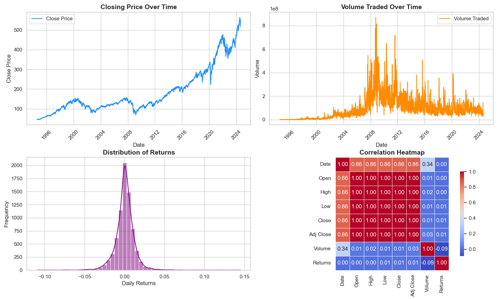
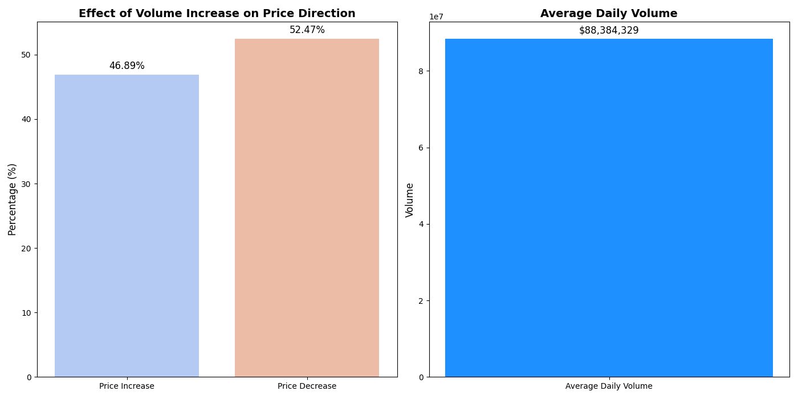
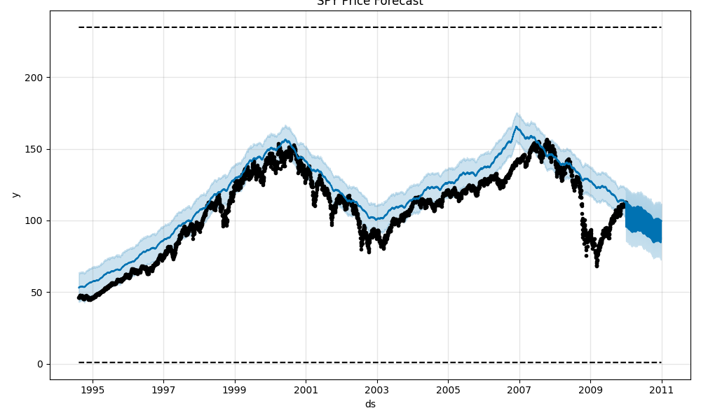
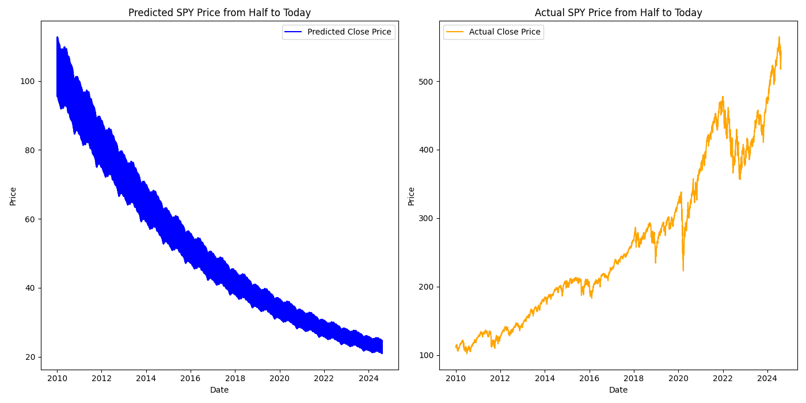
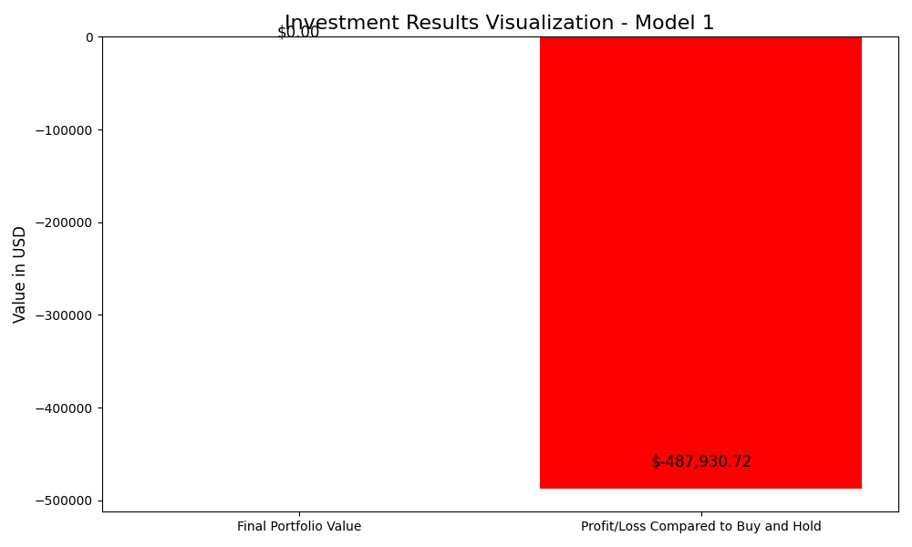
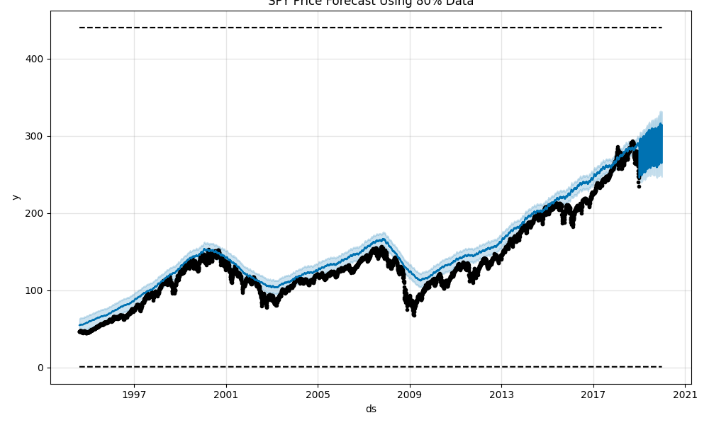
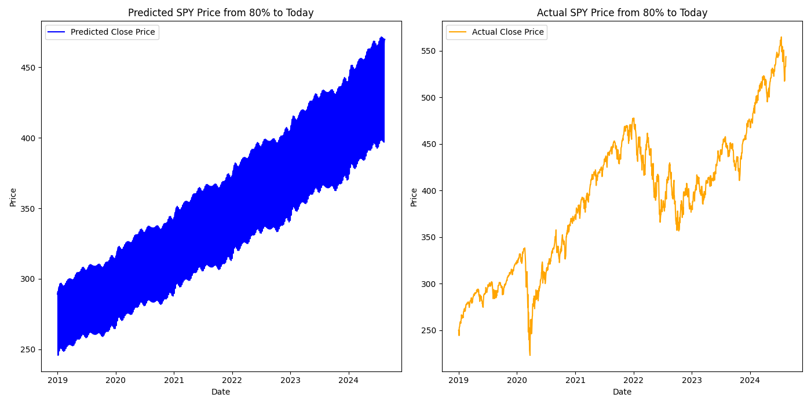
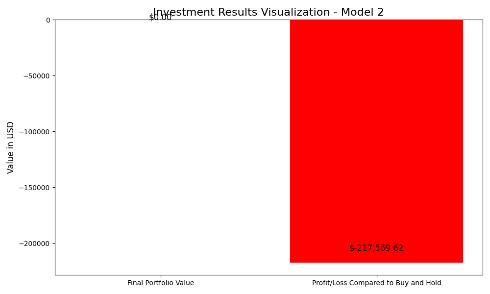

# SPY Stock Price Forecasting Using Facebook Prophet

This project involves forecasting the SPY stock price using Facebook Prophet, analyzing the impact of volume on price movements, and comparing the results to a buy-and-hold strategy.

## Files and Folders

- **1_PreliminaryDataVisualization.py**: Script for initial data exploration and visualization of SPY stock data.
- **2_VolumeChangeEffectOnPrice.py**: Script to analyze the effect of volume on price changes.
- **3_FB_Prophet_Model1.py**: Script to create a Facebook Prophet model using 50% of the data.
- **4_FB_Prophet_Model2.py**: Script to create a Facebook Prophet model using 80% of the data.
- **Images/5_Model1_Data.png**: Visualizations of the model trained on 50% data.
- **Images/6_Model2_Data.png**: Visualizations of the model trained on 80% data.
- **Images/7_Model1_Results.png**: Investment strategy results based on Model 1.
- **Images/8_Model2_Results.png**: Investment strategy results based on Model 2.
- **SPY_Price_Prediction_Half_to_Today.csv**: Predicted SPY prices from the 50% dataset model.
- **SPY_Price_Prediction_80_to_Today.csv**: Predicted SPY prices from the 80% dataset model.
- **Data Sources**: The initial dataset was obtained from Yahoo Finance.

## Overview

The project starts with the exploration of SPY stock data, followed by analyzing how volume affects price changes. Two models were created using Facebook Prophet—one using 50% of the data and another using 80%. The results showed that the buy-and-hold strategy outperformed the predictive models, though the 80% model performed better, suggesting the potential for further refinement.

## Conclusion

While the buy-and-hold strategy remains superior, the improved performance of the 80% model hints at the possibility of enhancing the model by incorporating additional factors.

## Visualizations

### Initial Data Visualizations

### Volume vs. Price Change Analysis

### Facebook Prophet Model 1 (50% Data)

### Facebook Prophet Model 2 (80% Data)

